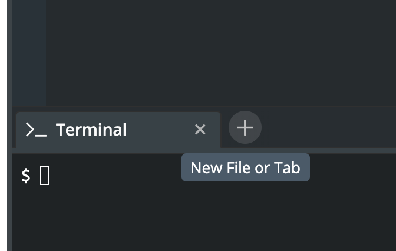
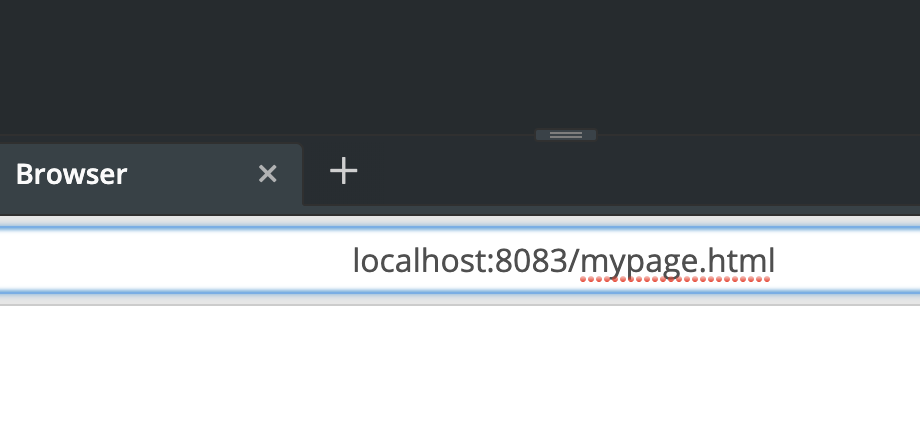
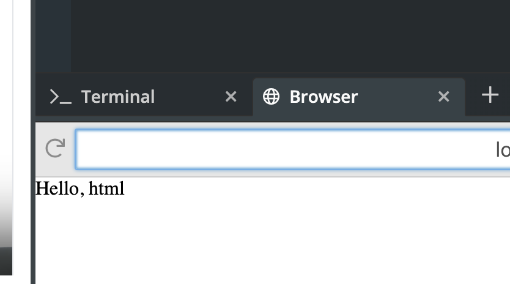
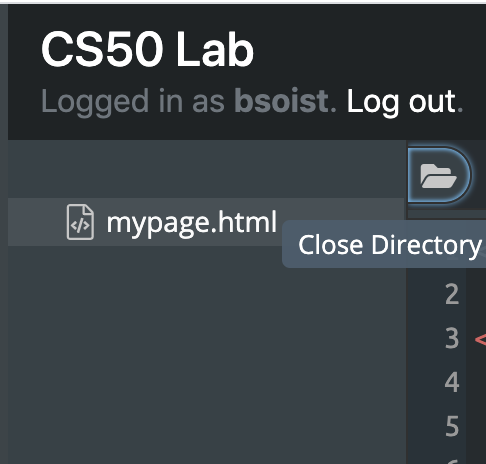
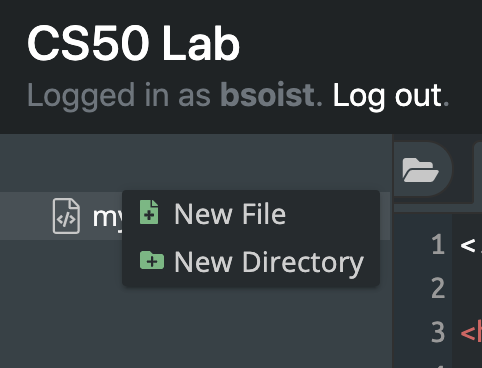
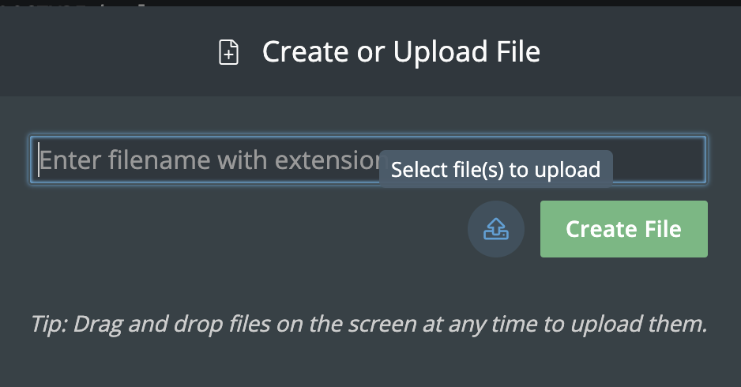

# Hello, HTML

## Getting Ready.  

Beyond introducing you to web programming, the overarching goal of this problem is to empower you to teach yourself new languages so that you can stand on your own at the end of the year. We’ll guide you through each, but if you nonetheless find yourself Googling and asking lots of questions of classmates and staff, rest assured you’re doing it right!

Let's get started!



## Setting Up Your Sandbox

Before we begin drafting some HTML, let's get our environment set up. Some of this is a little tedious, so be careful to follow the directions carefully.

First, let's opan a web browser to view our page.

Click on the little plus sign next to the Terminal tab.



Click _Browser_ to open a browser window.


You should now note that there is a link to `mypage.html` but we are going to navigate to the page a little differently so we don't have to keep clicking on the link.

Click into the address bar and add `/mypage.html` to the end and hit enter. You should see your page rendered now.



Now note that you can...

1. Refresh your page whenever you want with that little refresh arrow.
2. Toggle between the browser and the terminal if you need to.






## Personalize the page

**NOTE: Everything you add to your page will be inside the `body` of the page. The only part of the `head` you will edit is the title.**

1. Change the title of the page
2. Add a heading with your name by adding code like this `<h1>Name</h1>`
3. Add a paragraph with this code `<p></p>` 
4. Inside that paragraph `<p>HERE</p>` type two sentences about yourself.
5. Refresh the page and make sure you like it. If not, go back a few steps and edit your markup.




## A Few of My Favorite Things

Now you will add two different lists of some favorite things. One of the lists will be ranked (ordered) and one not - so choose wisely. Many students like to do their favorite foods, books, movies, sports, etc, but you can choose anything that's appropriate for a school assignment.

Each list will have the items marked up like this `<li>item</li>`

Ordered lists have those list items inside of `<ol></ol>`.

Un-ordered lists have those list items inside of `<ul></ul>`.

Something like this...

```
<ul>
    <li>item one</li>
    <li>item two</li>
    <li>item three</li>
</ul>
```

**NOTE: Each list should have at least 3 items and no more than 10.**


```
<p>Favorite Movies</p>
<ul>
    <li>The Lion King</li>
    <li>The Empire Strikes Back</li>
    <li>Planet of the Apes</li>
    <li>Godzilla</li>
</ul>

<p>Favorite Foods</p>
<ol>
    <li>Pizza</li>
    <li>Cookies</li>
    <li>Ice Cream</li>
</ol>
```


1. Refresh your browser, if your not done, edit and try again.




## Now let's add a picture

There are a lot of ways to add images to your page, but let's start with making sure you know how to use your own images.

Click the little folder icon to the left of your `mypage.html` tab.



Hover your mouse just to the left of that and you should find three dots appear (above those you can already see). Click on those and then click _New File_



Click on the upload icon.



Now upload one of your own pictures. You should now see it listed in the sidebar.

### Add the markup for the image.

Image elements look like this

``

Where src is set to the URL of the image and alt is set to a description of the image. URLs can be absolute or relative. Relative is always better if you can use it. So, let's use a relative URL for this image.

Paste this code into the `body` of your page somewhere.

``

where `NAMEOFIMAGE` is the name of the file you uploaded.

Refresh the page. If the image appears, click next



## Now let's add a couple of links

Let's add a link to a new page on your site and a link to an external site.

Click the plus sign next to the `mypage.html` tab and create a new file named `newpage.html`

Copy the markup below.

```
<!DOCTYPE html>
<html>
    <head>
        <title>New Page</title>
    </head>
    <body>
        <h1>Welcome!</h1>
        <a href="mypage.html">Go back home</a>
    </body>
</html>
```

Paste that code into the new page, save it, and then click on `mypage.html` to get back to that page's markup.

Copy the markup below and paste it somewhere in the `body` of `mypage.html`

```
<a href="newpage.html">My New Page</a>
<a href="http://duckduckgo.com/">Duck Duck Go</a>
```

**NOTE how the `<a>` element works - href is set to a relative or absolute URL and the text you want the visitor to click on is "inside" the opening and closing tags.**

Refresh the page. If the links appear, click Next



## How to Submit

To ensure that your page is well formed, you can use the [W3Schools HTML Validator service](https://validator.w3.org/#validate_by_input), copying and pasting your HTML directly into the provided text box. 

Before you can submit, you need to make a copy of your wepage.

Type the following command and press enter

```
cp mypage.html index.html
```

You may then submit by typing in at the command line:

```
submit50 cs50/problems/2019/ap/homepage
```

and pressing enter.



## Add more to your page

If time allows, add more valid HTML to your page. **DO NOT** add any CSS or JavaScript yet. We will do those in a later lesson.

## To get more help with HTML and CSS

* [HTML](https://www.w3schools.com/html/)

* [CSS](https://www.w3schools.com/css/)
