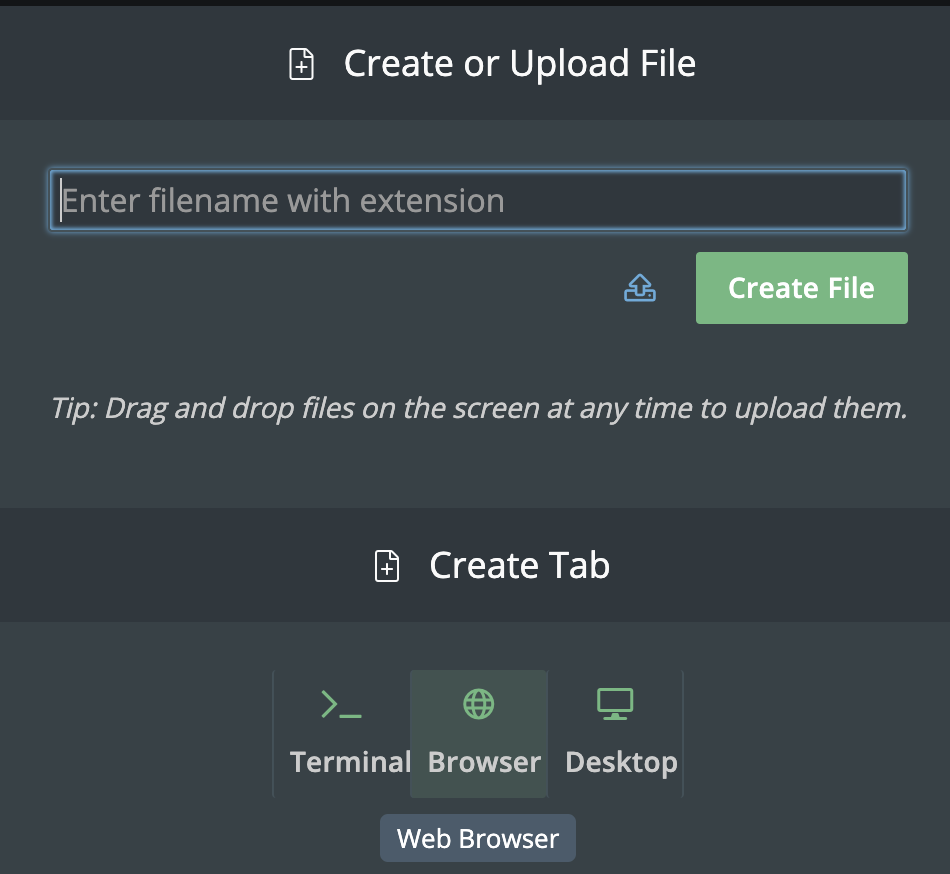

# Hello, HTML

## Getting Ready.  

Beyond introducing you to web programming, the overarching goal of this problem is to empower you to teach yourself new languages so that you can stand on your own at the end of the year. We’ll guide you through each, but if you nonetheless find yourself Googling and asking lots of questions of classmates and staff, rest assured you’re doing it right!

Let's get started!



## Setting Up Your Sandbox

Before we begin drafting some HTML, let's get our environment set up. Some of this is a little tedious, so be careful to follow the directions carefully.

First, let's opan a web browser to view our page.

Click on the little plus sign next to the Terminal tab.


Click _Browser_ to open a browser window.



You should now note that there is a link to `mypage.html` but we are going to navigate to the page a little differently so we don't have to keep clicking on the link.

Click into the address bar and add `/mypage.html` to the end and hit enter. You should see your page rendered now.


Now note that you can...

1. Refresh your page whenever you want with that little refresh arrow.
2. Toggle between the browser and the terminal if you need to.


### Now let's write some markup



## Personalize the page

1. Change the title of the page
2. Add a heading with your name by adding code like this `<h1>Name</h1>`
3. Add a paragraph with this code `<p></p>` 
4. Inside that paragraph `<p>HERE</p>` type two sentences about yourself.
5. Refresh the page and make sure you like it. If not, go back a few steps and edit your markup.
6. Raise your hand and show your teacher.

### After your teacher approves, click Next



## A Few of My Favorite Things

Now you will add two different lists of some favorite things. One of the lists will be ranked (ordered) and one not - so choose wisely. Many students like to do their favorite foods, books, movies, sports, etc, but you can choose anything that's appropriate for a school assignment.

Each list will have the items marked up like this `<li>item</li>`

Ordered lists have those list items inside of `<ol></ol>`.

Un-ordered lists have those list items inside of `<ul></ul>`.

Something like this...

```
<ul>
    <li>item one</li>
    <li>item two</li>
    <li>item three</li>
</ul>
```

**NOTE: Each list should have at least 3 items and no more than 10.**


```
<ul>
    <li>item one</li>
    <li>item two</li>
    <li>item three</li>
</ul>

<ol>
    <li>item one</li>
    <li>item two</li>
    <li>item three</li>
</ol>
```


1. Refresh your browser, if your not done, edit and try again.
2. When you're done, raise your hand to show your teacher.

### After your teacher approves, click Next



## Now let's add a picture

There are a lot of ways to add images to your page, but let's start with making sure you know how to use your own images.

Right-click on the image below and download it to your computer.


Click the little folder icon to the left of your `mypage.html` tab.


Hover your mouse just to the left of that and you should find three dots appear (above those you can already see). Click on those and then click _New File_


Click on the uplode icon.


Now upload the picture you just downloaded. You should see a file in the sidebar named `vanilla.png`


### Now let's a couple of links



# Ready to Start?

Hopefully, you should now be ready to go! Your assignment is simply to create a web page. You should have one HTML file (named whatever you’d like, it does not need to be index.html) containing the web page’s structure, and one CSS file for styling. Other than that, there are no restrictions on other things you’d like to include.

Feel free to be creative with this assignment. Make something that is meaningful to you - it could be a blog post, a pseudo-shopping website, or a family tree. The sky is the limit! At the bare minimum, your page MUST include the following:

* A table

* A link to an external website

* A button (which needn’t actually have a function, but should exist on the page)

* At least two divs, with div IDs

* A list

* A heading

* A paragraph

* At least three images, either externally linked or contained within your ~/workspace/unit5 directory

* At least one block of text that is not left-aligned

* At least two different fonts

* At least three different colors of text

* At least two other extra features, one in HTML and one in CSS

* Of course, you can do many more of each of the above; and to make a neat website, you’ll have to!

Because this assignment will result in something different for each person, there’s no check50 for this one. Make sure that you’ve included everything listed above and you have no broken links or permission issues and you should be good to go.

## How to View Your Web Page

Type http-server in the terminal and click on the link. You will open a new browser window with your web page!

## To get more help with HTML and CSS

* [HTML](https://www.w3schools.com/html/)

* [CSS](https://www.w3schools.com/css/)

## How to Submit

To ensure that your page is well formed, you can use the [W3Schools HTML Validator service](https://validator.w3.org/#validate_by_input), copying and pasting your HTML directly into the provided text box. 

You may then submit by typing in at the command line:

submit50 cs50/2018/ap/unit5


